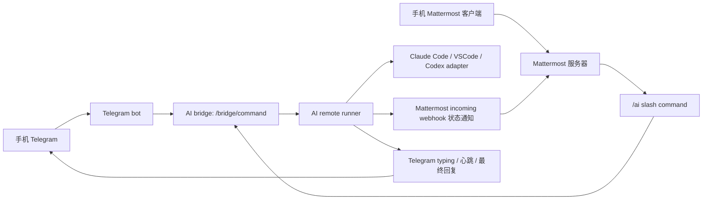

# FFC-AI 小白部署指南

本文根据当前仓库脚本和代码整理，适合第一次部署的人照着走。

先说结论：FFC-AI 不是一个新的聊天软件。它用 Telegram 和/或 Mattermost 当手机聊天入口，用本地或服务器上的 AI runner 去调用 Claude Code、VSCode、Codex 等 AI 工具。Telegram 更简单、速度快，适合当日常主入口；Mattermost 更适合自建团队频道、webhook 和 slash command。真正的 AI 执行逻辑都在 runner 里。

## 1. 它到底是怎么工作的



Telegram 和 Mattermost 地位同等。你可以只用 Telegram、只用 Mattermost，或者两个都装。功能是否一样，不取决于谁排在前面，而取决于最后有没有配好同一套 runner 能力、命令表和状态通知。

如果用 Telegram，你需要：

- BotFather 创建的 bot token。
- 你的 Telegram ID 或发现模式拿到的 chat_id。
- `ai-telegram-bot.service` 已安装并启动。
- bot 能访问 runner 的命令处理逻辑。

如果用 Mattermost，你可以把它部署在 VPS、1Panel、Docker、云服务器，或者其他位置。需要配好：

- Mattermost 能用手机正常登录。
- Mattermost 开启了 bot、incoming webhook、slash command。
- 创建了 `/ai` slash command，并指向 AI bridge。
- 创建了 incoming webhook，用来接收 runner 的状态通知。
- runner 端保存了 Mattermost 的 URL、webhook URL、slash token、bridge shared secret。
- Mattermost 能访问 runner 的 `/bridge/command` 地址。

Telegram 和 Mattermost 的普通状态/帮助命令都会尽量同步返回；Claude Code、VSCode 或 Codex 这类长 AI 任务会先返回“已收到/后台运行”，随后持续发送排队、调用、运行、完成或失败状态，避免手机端看不出它是在思考、联网、执行工具，还是已经断开。

## 2. 推荐准备

### 手机入口

Telegram 不需要单独部署聊天服务器，只要 BotFather token 和 Telegram ID。它最轻，速度也快，适合作为日常主入口。

Mattermost 需要一台通信服务器。推荐：

- 一台 VPS。
- 一个域名，例如 `ai.example.com`。
- 域名解析到 VPS 公网 IP。
- 80 和 443 端口开放。
- Ubuntu/Debian 更省心。

脚本自带的通信服务器安装器会安装：

- Mattermost Team Edition 最新官方 release，且不低于 `10.11.0`
- PostgreSQL `15.10-alpine`
- Caddy `2.8.4-alpine`
- Docker / Docker Compose

Mattermost 版本默认来自官方 GitHub latest release。这样手机 App 要求新服务端时，新安装会自动跟上。你也可以手动固定版本：

```bash
sudo env MATTERMOST_VERSION=11.7.2 scripts/install-communication-vps.sh --domain ai.example.com
```

脚本会拒绝安装低于 `10.11.0` 的 Mattermost 版本。PostgreSQL 和 Caddy 版本来自 `versions.lock`，并且仍然锁了 digest。

### AI runner 机器

AI runner 可以跑在：

- 本地 Linux
- WSL
- 小主机
- 另一台云服务器
- 和 Mattermost 同一台 VPS

runner 机器需要：

- Python 3.10+
- `sudo`
- `apt-get`，如果要让脚本自动装依赖
- `curl`、`git`、`openssl`、`gpg`
- Claude Code、VSCode 或 Codex 相关 CLI，取决于你要用哪个 AI

如果系统有 systemd，脚本会创建：

```text
/etc/systemd/system/ai-remote-runner.service
```

如果没有 systemd，比如部分 WSL 环境，脚本会生成：

```text
/opt/ai-remote-runner/run-local.sh
```

## 3. 两种通信入口思路

### 方式 A：Telegram 直连 runner

适合你想先最快把手机和 AI runner 打通。

在 runner 安装时启用 Telegram：

```bash
AI_RUNNER_COMPONENTS=codex,telegram sudo -E scripts/install-runner.sh
# 或：
AI_RUNNER_COMPONENTS=claude-code,telegram sudo -E scripts/install-runner.sh
# 或：
AI_RUNNER_COMPONENTS=vscode,telegram sudo -E scripts/install-runner.sh
sudo scripts/pair-telegram.sh --telegram-id 你的TelegramID
```

脚本会安全提示输入 BotFather token，并启动：

```text
ai-telegram-bot.service
```

Telegram 和 Mattermost 使用同一套 `/ai` 命令表、同一套 provider 选择、同一套长对话/新对话策略、同一套全权限开关。
配对完成后，`pair-telegram.sh` 会自动运行 `validate-core-ready.sh`，只对本机启用的 provider 做真实 full-access smoke，验证 root、网络、文件、venv/安装能力。不通过就不会把 `core_ready` 标记成 true。

### 方式 B：用本项目脚本部署 Mattermost

适合你想让脚本帮你装 Mattermost、Caddy、PostgreSQL。

在 VPS 上执行：

```bash
git clone https://github.com/vpn3288/FFC-AI.git
cd FFC-AI

scripts/install-communication-vps.sh --dry-run --domain ai.example.com
sudo scripts/install-communication-vps.sh --domain ai.example.com
```

把 `ai.example.com` 换成你自己的域名。

脚本会把 Mattermost 安装到：

```text
/opt/ffc-ai-mattermost
```

重要文件：

```text
/opt/ffc-ai-mattermost/.env
/opt/ffc-ai-mattermost/docker-compose.yml
/opt/ffc-ai-mattermost/mattermost-objects.json
/opt/ffc-ai-mattermost/install-manifest.json
```

安装后注意两点：

- `install-manifest.json` 里一开始会是 `platform_ready=false`，这是正常的。
- 如果安装时还不知道 runner 的 bridge 地址，`/ai` slash command 会暂时不创建，后面要补。

### 方式 C：用 1Panel 或已有 Mattermost

可以。只要你最终手动完成同样的 Mattermost 配置，功能上没有区别。

你需要在 Mattermost 里准备：

- 一个 team，例如 `ai-lab`。
- 几个频道，例如 `ai-ops`、`ai-status`、`ai-reviews`、`ai-errors`、`ai-archive`。
- 一个 incoming webhook，建议绑定到 `ai-status`。
- 一个 slash command：
  - trigger：`ai`
  - command：用户输入时就是 `/ai`
  - request URL：runner 的 `/bridge/command`
  - method：POST
- 复制 slash command token。

如果你想用 `scripts/bootstrap-mattermost.sh` 自动创建 team、频道、bot、webhook、slash command，需要注意：这个脚本依赖 `mmctl --local`。它默认认为 Mattermost 位于 `/opt/ffc-ai-mattermost`，并且 Docker Compose 服务名叫 `mattermost`。1Panel 的目录和服务名可能不同，所以你可能需要手动创建这些对象，或者改脚本适配你的 1Panel 部署。

## 4. 安装 AI runner

在 runner 机器上执行：

```bash
git clone https://github.com/vpn3288/FFC-AI.git
cd FFC-AI

AI_RUNNER_COMPONENTS=codex,telegram scripts/install-runner.sh --dry-run
AI_RUNNER_COMPONENTS=codex,telegram sudo -E scripts/install-runner.sh
```

现在脚本要求显式声明这台机器要装什么，避免一台机器意外装入多个 AI 工具。常用选择：

```bash
# Codex 专机，带 Telegram
AI_RUNNER_COMPONENTS=codex,telegram sudo -E scripts/install-runner.sh

# Claude Code 专机，带 Telegram
AI_RUNNER_COMPONENTS=claude-code,telegram sudo -E scripts/install-runner.sh

# VSCode 专机，带 Telegram，启用独立 vscode adapter
AI_RUNNER_COMPONENTS=vscode,telegram sudo -E scripts/install-runner.sh
```

`all`、`full`、`core` 这类混装入口已默认拒绝。实验室部署按“一台 VM 一种 AI/工具”拆开：Codex 专机、Claude Code 专机、VSCode 专机分别安装，Telegram 可以加在任何一台上作为同等通信入口。

带 `telegram` 的安装会额外安装 `ai-telegram-bot.service`。如果还没有 BotFather token，服务会先装好但不启动，后面配对时再启动。

VSCode 组件会安装/验证 VSCode，并创建 root/full-access 包装器：

```text
/usr/local/bin/code-root
```

`code-root` 会用 root 的 VSCode 数据目录和扩展目录启动 `code`，并传入 `--no-sandbox`、`--disable-workspace-trust`，用于这类专门创建的 VM/测试机。脚本还会写入 root VSCode User settings，默认关闭 workspace trust 和 telemetry。`VSCODE_CLAUDE_MODEL` 是 VSCode adapter 的模型变量；兼容旧环境变量 `VSCODE_MODEL`。

`AI_DEFAULT_PROVIDER` 只决定默认把任务发给谁，并且必须属于本机显式安装的 provider。例如 Codex 专机：

```bash
AI_RUNNER_COMPONENTS=codex,telegram AI_DEFAULT_PROVIDER=codex sudo -E scripts/install-runner.sh
```

runner 默认目录：

```text
/var/lib/ai-remote-runner        # 状态、配置、凭据、上下文
/srv/ai-workspaces              # AI 工作区
/opt/ai-remote-runner           # 安装代码
```

runner 配置文件：

```text
/var/lib/ai-remote-runner/config.env
```

systemd 服务：

```bash
sudo systemctl status ai-remote-runner
sudo systemctl restart ai-remote-runner
```

## 5. Claude Code、VSCode 和 Codex

### Claude Code

如果你启用了 `claude-code`，脚本会：

- 检查 `claude --version`
- 如果没有安装，会尝试按官方 apt 源安装
- 检查 `claude auth status --json`

所以你需要提前完成 Claude Code 登录或 API 配置。否则 runner 不能进入 core ready。

### Codex

如果你启用了 `codex`，脚本会：

- 检查 `codex --version`
- 如果没有安装，会尝试通过 npm 安装 `@openai/codex@0.137.0`

如果你提前设置了这些变量，脚本会写入 Codex 配置：

```bash
export OPENAI_API_KEY="你的 OpenAI API Key"
export CODEX_MODEL="gpt-5.5"
export CODEX_BASE_URL="https://api.openai.com/v1"
```

脚本默认按 root/global 模式配置 AI 工具：systemd 服务显式以 root 运行，`HOME=/root`，`CODEX_HOME=/root/.codex`，Codex 配置启用 `approval_policy="never"`、`sandbox_mode="danger-full-access"`、`openai_base_url` 和 `[sandbox_workspace_write].network_access=true`。安装预检还会确认 `codex exec` 支持 `--json`、`--ephemeral`、`--cd`、`--output-last-message`、`--add-dir /`、`--skip-git-repo-check` 以及 full-access 运行模式；这些能力会写入 install manifest 并显示在 `/ai 功能` 里。如果你显式设置 `AI_TOOL_HOME` 或 `AI_CODEX_HOME`，才会写到自定义目录。

Claude 后端默认不传原生 `--max-turns` 和 `--max-budget-usd` 限制，`CLAUDE_MAX_TURNS=0`、`VSCODE_CLAUDE_MAX_TURNS=0`、`AI_TASK_RESERVED_USD=0`、`TELEGRAM_RESERVED_USD=0` 都表示无限/不由 runner 限制；单次任务预算为 `0` 时也不会触发 runner 的 daily/monthly budget preflight。需要主动限轮时，显式设置对应 adapter 的 max-turns，或在 Telegram 里执行 `/ai 轮数 设置 [claude-code|vscode] <正整数>`；恢复无限可执行 `/ai 轮数 设置 [claude-code|vscode] 无限`。

模型切换分为两条命令，避免 GPT/Claude 的别名和网关配置互相污染：

```text
/ai GPT模型 设置 [codex|claude-code|vscode] gpt-5.5
/ai Claude模型 设置 [codex|claude-code|vscode] claude-opus-4-8
```

`codex` 会写 `CODEX_MODEL` 和 `~/.codex/config.toml`；`claude-code` 会写 `CLAUDE_MODEL`；`vscode` 会写 `VSCODE_CLAUDE_MODEL`。当 `codex` 使用 Claude 模型，或 Claude 后端使用 GPT 模型时，当前配置的 `CODEX_BASE_URL` 或 `ANTHROPIC_BASE_URL` 网关必须支持对应模型。旧 `/ai 模型 使用 ...` 仍保留兼容，但推荐改用上面两条明确命令。

### VSCode

脚本会检查 `code --version`。如果没有安装，并且系统支持 apt，会通过 Microsoft apt repository 安装最新 `code` 包。安装后会写入 `/usr/local/bin/code-root`，方便在 VM 内以 root/full-access 方式启动 VSCode。带 Telegram/runner 安装时，VSCode 作为独立 `vscode` provider 出现在 `/ai 提供商`、`/vscode`、`/ai GPT模型 设置 vscode ...` 和 `/ai Claude模型 设置 vscode ...` 中，配置项使用 `VSCODE_CLAUDE_*`，不会和 `claude-code` provider 共用轮数、重试和模型变量。

## 6. 让 Mattermost 能访问 runner

Mattermost 的 slash command 必须能请求到：

```text
http://runner可访问地址/bridge/command
```

runner 默认监听：

```text
127.0.0.1:8765
```

如果 Mattermost 和 runner 在同一台机器，可能可以用：

```text
http://127.0.0.1:8765/bridge/command
```

但如果 Mattermost 跑在 Docker 容器里，`127.0.0.1` 可能指的是 Mattermost 容器自己，不是宿主机。这时要换成容器能访问到的宿主机地址、内网地址、VPN 地址，或自己配置 `host.docker.internal` / host-gateway。

如果 runner 在家里、WSL 或本地机器，可以用反向 SSH 隧道。脚本提供：

```bash
sudo scripts/setup-runner-tunnel.sh --vps-host YOUR_VPS_IP
```

它会创建：

```text
/etc/systemd/system/ai-remote-runner-tunnel.service
```

默认把 VPS 的：

```text
127.0.0.1:18765
```

转发到 runner 本机的：

```text
127.0.0.1:8765
```

脚本最后会提示：

```text
bridge command URL from the VPS is http://127.0.0.1:18765/bridge/command
```

再次提醒：这个 URL 是 VPS 主机视角。Mattermost 容器不一定能直接访问 VPS 主机的 `127.0.0.1`。

## 7. 创建或补全 `/ai` slash command

如果你用项目脚本部署 Mattermost，并且现在已经知道 `BRIDGE_COMMAND_URL`，可以在 VPS 上重新运行 bootstrap：

```bash
cd FFC-AI

sudo env MATTERMOST_INSTALL_DIR=/opt/ffc-ai-mattermost \
  BRIDGE_COMMAND_URL="http://你的-bridge-地址/bridge/command" \
  bash scripts/bootstrap-mattermost.sh
```

这个脚本会：

- 创建或复用 `ai-lab` team。
- 创建或复用 `ai-ops`、`ai-status` 等频道。
- 创建 bot 身份。
- 把管理员账号、邮箱、密码同步到 `.env` 中记录的值。
- 开启 bot、webhook、commands。
- 创建 incoming webhook。
- 如果提供了 `BRIDGE_COMMAND_URL`，创建 `/ai` slash command。
- 如果 slash command 指向 `127.0.0.1`、内网 IP 或 `host.docker.internal`，自动配置 Mattermost 允许访问这个内网 bridge host，并在可判断服务类型时重启 Mattermost 让配置生效。
- 把 slash token 写入 `/opt/ffc-ai-mattermost/.env`。

incoming webhook 的 ID 会在：

```text
/opt/ffc-ai-mattermost/mattermost-objects.json
```

如果 ID 是 `abc123`，你的 webhook URL 通常是：

```text
https://ai.example.com/hooks/abc123
```

## 8. 配对 runner 和 Mattermost

runner 需要知道：

- Mattermost 地址
- incoming webhook URL
- slash command token
- bridge shared secret

当前 `pair-runner.sh` 要求 secret 和 slash token 从文件或 stdin 读取，不建议直接写在命令参数里。

先准备两个只给 root 读的文件：

```bash
sudo install -m 600 /dev/null /root/ffc-ai-bridge-secret
sudo install -m 600 /dev/null /root/ffc-ai-slash-token
```

把 bridge secret 写入 `/root/ffc-ai-bridge-secret`。

如果 runner 已经安装过，可以从 runner 配置里取：

```bash
sudo awk -F= '$1=="AI_BRIDGE_SHARED_SECRET"{print $2}' \
  /var/lib/ai-remote-runner/config.env | sudo tee /root/ffc-ai-bridge-secret >/dev/null
sudo chmod 600 /root/ffc-ai-bridge-secret
```

如果你要使用通信脚本生成的 secret，可以从 VPS 的：

```text
/opt/ffc-ai-mattermost/.env
```

读取 `AI_BRIDGE_SHARED_SECRET`，再通过 SSH、密钥管理器或其他安全方式传到 runner。

把 slash token 写入 `/root/ffc-ai-slash-token`。

如果你用项目脚本创建了 slash command，可以从 VPS 的 `.env` 里读取：

```bash
sudo awk -F= '$1=="MATTERMOST_SLASH_TOKEN"{print $2}' \
  /opt/ffc-ai-mattermost/.env | sudo tee /root/ffc-ai-slash-token >/dev/null
sudo chmod 600 /root/ffc-ai-slash-token
```

然后在 runner 机器上执行：

```bash
cd FFC-AI

sudo scripts/pair-runner.sh \
  --platform-url "https://ai.example.com" \
  --webhook-url "https://ai.example.com/hooks/你的WebhookID" \
  --transfer-method manual-secure \
  --bridge-secret-file /root/ffc-ai-bridge-secret \
  --slash-token-file /root/ffc-ai-slash-token
```

配对脚本会写入：

```text
/var/lib/ai-remote-runner/config.env
```

`pair-runner.sh` 写完配置后会在 systemd 环境中自动重启 `ai-remote-runner.service`，让新的 slash token 生效。

```bash
sudo systemctl restart ai-remote-runner
```

如果你是在无 systemd 环境中运行，或者你想手动确认，可以重新启动：

```bash
sudo /opt/ai-remote-runner/run-local.sh
```

## 9. 配对 Telegram

Telegram 不需要再部署聊天服务器，只需要一个 Telegram BotFather token。它和 Mattermost 是同等级入口；你完全可以把 Telegram 当日常主要入口。

在 Telegram 里：

- 找到 `@BotFather`。
- 发送 `/newbot` 创建机器人。
- 复制 BotFather 给你的 bot token。
- 打开你自己的 bot，随便发一条消息，比如 `/start`。

如果你已经知道 Telegram ID，可以直接配对：

```bash
cd FFC-AI
sudo scripts/pair-telegram.sh \
  --telegram-id 你的TelegramID
```

脚本会提示输入 BotFather 给你的机器人密钥，输入时不会回显。配对时会先调用 Telegram `getMe` 验证 token，默认调用 `deleteWebhook` 清掉旧 webhook，避免 long polling 启动后收不到消息；随后同步 Telegram 命令菜单，发送一条配对测试消息并立刻用 `editMessageText` 原地编辑它，验证实时状态更新路径可用；最后写入配置并启动 `ai-telegram-bot.service`。`--reserved-usd` 支持数字，也支持 `0`、`unlimited`、`无限` 表示不由 Telegram 配对配置限制预算。

如果你要自动化部署，也可以把 token 放到 runner 机器的 root 只读文件里：

```bash
sudo install -m 600 /dev/null /root/ffc-ai-telegram-token
sudo nano /root/ffc-ai-telegram-token
```

如果你还不知道自己的 Telegram `chat_id`，先用发现模式启动：

```bash
cd FFC-AI
sudo scripts/pair-telegram.sh \
  --bot-token-file /root/ffc-ai-telegram-token \
  --discover-chat-id
```

然后给 bot 发送 `/ai 状态`，它会回复未配对提示，里面包含 `chat_id`。这个模式不会执行 AI 命令。

拿到 `chat_id` 后，重新配对成只允许你的 chat：

```bash
sudo scripts/pair-telegram.sh \
  --bot-token-file /root/ffc-ai-telegram-token \
  --telegram-id 你的TelegramID
```

配对脚本会写入：

```text
/var/lib/ai-remote-runner/config.env
```

并启动或重启：

```text
ai-telegram-bot.service
```

之后你可以在 Telegram 里发送：

```text
/ai 状态
/ai 帮助
请总结这个项目现在还有哪些待办
```

当 AI 任务正在运行时，Telegram bot 会发送 `typing` 状态，并用一条状态消息原地更新 queued、calling、running command、writing files、done/error 等状态；Codex 会把 `codex exec --json` 的 JSONL 事件转换成这些手机端状态。如果编辑失败才回退为发送新消息。如果长时间没有最终回复，先看这些心跳和 runner 日志，而不是判断为没有连接。群聊默认是 `TELEGRAM_GROUP_MODE=mention`，也就是只处理 `/ai`、`/codex` 这类命令、@bot 的消息或回复 bot 的消息；需要吃掉群内所有消息时才改成 `all`。

## 10. 验证是否打通

### 验证 runner 自己

在 runner 机器上：

```bash
cd FFC-AI
sudo scripts/validate-core-ready.sh
```

成功时会看到：

```text
[validate-core-ready] core_ready=true
```

`validate-core-ready.sh` 会读取本机配置里的 `AI_RUNNER_PROVIDERS`，只实际调用本机启用 provider 的 full-access smoke test。Codex 专机只测 Codex，Claude Code 专机只测 Claude Code，VSCode 专机只测 vscode adapter；只有空 provider 的 management-only 机器才只验证 runner 命令和 bridge loopback。启用的 provider 不能以 root/full-access 方式运行时，不会写入 `core_ready=true`。

这个脚本会检查：

- provider 命令是否存在。
- `/ai 状态` 是否能通过 bridge loopback 执行。
- `AI_BRIDGE_SHARED_SECRET` 是否配置。

### 验证 Mattermost + runner 集成

在能访问两边配置的机器上：

```bash
cd FFC-AI
sudo scripts/validate-integration.sh
```

成功时会看到：

```text
[validate-integration] bridge loopback passed
[validate-integration] Mattermost /ai commands and credential confirmation passed
```

如果当前机器只能访问 bridge，不能登录 Mattermost REST API，可以临时跳过 slash command 层测试做诊断：

```bash
sudo env VALIDATE_MATTERMOST_COMMAND=false scripts/validate-integration.sh
```

注意：跳过 slash command 时只会验证 runner bridge，不会把 Mattermost 的 `platform_ready` 标记为 validated。

如果你要在真实验收时连同 Mattermost 后台 AI 任务派发一起测，可以显式打开：

```bash
sudo env VALIDATE_MATTERMOST_BACKGROUND_TASK=true scripts/validate-integration.sh
```

默认不打开这个开关，是为了避免普通集成检查消耗 provider 预算；`validate-core-ready.sh` 已经单独对本机启用的 provider 做 full-access 文件写读、网络、venv/安装能力 smoke。

完整验证通过后，脚本会把：

```text
/var/lib/ai-remote-runner/install-manifest.json
/opt/ffc-ai-mattermost/install-manifest.json
```

里的集成状态更新为 validated。runner 的 `core_ready` 仍由 `scripts/validate-core-ready.sh` 负责验证和更新。

### 手机上验证

打开 Mattermost，在频道里输入：

```text
/ai 状态
```

再试：

```text
/ai 帮助
/ai 提供商 列表
/ai 工作区 列表
/ai 上下文
```

如果这些能返回结果，说明 slash command 已经能到达 runner。

## 11. 当前支持的 `/ai` 命令

下面是当前 `src/ai_remote_runner/commands.py` 和 `executor.py` 实际支持的主要命令。

基础：

```text
/ai 状态
/ai 帮助
/ai 命令
/ai 功能
/ai 确认 <token>
```

上下文和会话：

```text
/ai 上下文
/ai 压缩
/ai 新对话
/ai 继续
/ai 每次新对话
/ai 持续对话
/ai 自动压缩 开启
/ai 自动压缩 关闭
```

权限模式：

```text
/ai 聊天模式 开启
/ai 编辑模式 开启
/ai shell模式 开启
/ai 完全访问 开启
/ai 最高权限 开启
/ai root权限 开启
```

默认就是 `完全访问`。Claude Code 的 `编辑模式` 和 `shell模式` 会直接切换到可执行对应工具的权限；只有你显式设置 `AI_REQUIRE_SHELL_CONFIRMATION=1` 时，shell 任务才会逐次确认。Codex 当前只按 full-access 执行，如果你把权限改成非 full 又选择 Codex，runner 会明确报“不支持该 scope”，不会悄悄用 full access 继续跑。

指令文件：

```text
/ai 全局 查看
/ai 全局 设置 <文本>
/ai 全局 追加 <文本>
/ai 全局 替换 <文本>
/ai 全局 回滚 <snapshot>
/ai 全局 应用

/ai 项目 查看
/ai 项目 设置 <文本>
/ai 项目 追加 <文本>
/ai 项目 替换 <文本>
/ai 项目 回滚 <snapshot>
/ai 项目 应用
```

工作区：

```text
/ai 工作区 列表
/ai 工作区 创建 <名字>
/ai 工作区 使用 <名字>
```

工作区名字只能用英文字母、数字、短横线、下划线。

提供商：

```text
/ai 提供商 列表
/ai 提供商 使用 claude-code
/ai 提供商 使用 codex
```

凭据：

```text
/ai 凭据 添加 <handle>
/ai 凭据 列表
/ai 凭据 测试 <handle>
/ai 凭据 删除 <handle>
```

密钥不要发到聊天里。当前代码会创建凭据句柄，然后要求通过本地命令或 bridge upload URL 写入密文。

扩展索引：

```text
/ai 扩展 列表
/ai 工具 列表
/ai mcp 列表
/ai 说明 生成 <id>
```

注意：当前扩展、工具、MCP 列表主要是占位索引，还没有实现一键安装扩展。

取消命令：

```text
/ai 停止
/ai 取消
```

当前取消会记录取消标记，并明确提示“不会强制终止已经启动的 provider 进程”。

## 12. 常见问题

### 1. 用 1Panel 部署 Mattermost，会不会少功能？

不会。只要最后 Mattermost 的 webhook、slash command、token、频道、bot 都配好，功能上和脚本部署没有区别。

区别只是：脚本会尝试自动创建这些对象；1Panel 通常只负责把 Mattermost 跑起来，集成对象要你手动配。

### 2. `/ai` 没反应怎么办？

按顺序查：

- Mattermost 的 slash command trigger 是否是 `ai`。
- slash command URL 是否是 `/bridge/command`。
- Mattermost 服务器是否能访问这个 URL。
- runner 服务是否在运行。
- runner 是否重启过，确认已加载最新 `MATTERMOST_SLASH_TOKEN`。
- `/var/lib/ai-remote-runner/config.env` 里是否有 `MATTERMOST_SLASH_TOKEN`。

查看 runner：

```bash
sudo systemctl status ai-remote-runner
sudo journalctl -u ai-remote-runner -n 100 --no-pager
```

### 3. `validate-core-ready.sh` 失败怎么办？

常见原因：

- `AI_BRIDGE_SHARED_SECRET` 没有写入 `/var/lib/ai-remote-runner/config.env`。
- runner 服务没启动。
- runner 服务还在用旧 secret，需要重启。
- 启用了 `claude-code`，但 `claude auth status --json` 没通过。
- 启用了 `codex`，但 `codex` 命令不存在。

### 4. `setup-runner-tunnel.sh` 提示 SSH key 没授权

脚本会打印一段公钥。把这段公钥加入 VPS 对应用户的：

```text
~/.ssh/authorized_keys
```

然后重新运行隧道脚本。

### 5. Mattermost 容器访问不到 `127.0.0.1:18765`

这是 Docker 网络视角问题。`127.0.0.1` 在容器里通常是容器自己。

可选解决思路：

- 使用 Mattermost 容器能访问的宿主机地址。
- 配置 Docker `host-gateway`。
- 让 SSH 隧道监听在 VPS 内网地址。
- 用 VPN 或内网穿透提供一个容器可访问的 bridge URL。

如果 `/ai` 的 URL 使用 `127.0.0.1`、内网 IP 或 `host.docker.internal`，重新运行 `bootstrap-mattermost.sh` 会自动把该 host 加入 Mattermost 的 `AllowedUntrustedInternalConnections`。如果仍然失败，再检查 Docker 网络视角下这个地址是否真的能连到 runner。

### 6. `/ai 状态` 里 core_ready 还是 false

`/ai 状态` 会读取 runner 的 install manifest。如果它仍然是 false，通常表示 core 验证或 Mattermost 集成验证还没跑完，重新执行：

```bash
sudo scripts/validate-core-ready.sh
sudo scripts/validate-integration.sh
```

然后再在手机里发送 `/ai 状态`。

## 13. 回滚和卸载

### 回滚 runner

```bash
sudo scripts/rollback-install.sh
```

它会：

- 停止并删除 `ai-remote-runner.service`。
- 删除 `/opt/ai-remote-runner/run-local.sh`。
- 尝试恢复旧的 `config.env`。
- 默认保留工作区和凭据。

### 停止 Mattermost 通信平台

```bash
sudo scripts/rollback-communication.sh
```

它会停止容器，但保留数据。

如果你明确要删除数据：

```bash
sudo scripts/rollback-communication.sh --delete-volumes
```

这会删除：

```text
/opt/ffc-ai-mattermost
```

请确认你真的不需要里面的数据。

## 14. 本地测试

开发或改脚本后可以跑：

```bash
scripts/smoke-test.sh
```

它会：

- 检查所有 shell 脚本语法。
- 跑 Python 单元测试。
- 测试 `/ai 状态` 解析。
- 测试命令索引、provider 探测、指令追加、预算记录。

## 15. 安全提醒

- 不要把 `AI_BRIDGE_SHARED_SECRET` 发到聊天里。
- 不要把 Mattermost slash token 发到聊天里。
- 不要把 API key、SSH 私钥、GitHub token 写进 `global.md` 或 `project.md`。
- 凭据应该走 credential broker，本地加密保存。
- `pair-runner.sh` 已经要求 secret 从文件或 stdin 读取，这是为了避免 shell history 和进程列表泄露。

## 16. 当前脚本状态总结

当前仓库已经有了核心骨架：

- Mattermost 安装脚本。
- Mattermost team/channel/bot/webhook/slash command bootstrap。
- AI runner 安装脚本。
- bridge HTTP 服务。
- Mattermost slash command 接入。
- Claude Code、VSCode、Codex provider 探测和调用。
- VSCode 安装和 root/full-access wrapper。
- 指令文件、工作区、凭据、预算、上下文的基础实现。
- 校验和回滚脚本。

但它还不是完全无脑的一键安装器：

- 1Panel 部署需要你手动创建或适配 Mattermost 集成对象。
- Docker Mattermost 到本机 runner 的网络地址需要你确认。
- systemd 环境下 `pair-runner.sh` 写配置后会自动重启 runner 服务；无 systemd 环境需要手动重新运行本地脚本。
- `/ai 停止`、`/ai 取消` 当前会记录取消标记，但不会强杀已经启动的 provider 进程。
- 扩展、工具、MCP 目前主要是列表占位，还没有完整安装流程。

如果你按这份 README 部署，最重要的验收标准是：

```text
手机 Mattermost 输入 /ai 状态，runner 能收到并返回结果。
```

做到这一步，通信层就打通了。后面再继续完善 provider、权限、凭据和自动化能力。
