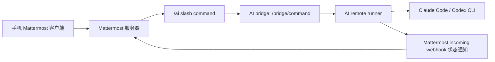

# FFC-AI 小白部署指南

本文根据当前仓库脚本和代码整理，适合第一次部署的人照着走。

先说结论：FFC-AI 不是一个新的聊天软件。它用 Mattermost 当手机聊天入口，用本地或服务器上的 AI runner 去调用 Claude Code、Codex 等 AI 工具。Mattermost 负责收发消息、频道、通知、`/ai` slash command；真正的 AI 执行逻辑在 runner 里。

## 1. 它到底是怎么工作的



你可以把 Mattermost 部署在 VPS、1Panel、Docker、云服务器，或者其他位置。功能是否一样，不取决于部署方式，而取决于最后有没有配好这些东西：

- Mattermost 能用手机正常登录。
- Mattermost 开启了 bot、incoming webhook、slash command。
- 创建了 `/ai` slash command，并指向 AI bridge。
- 创建了 incoming webhook，用来接收 runner 的状态通知。
- runner 端保存了 Mattermost 的 URL、webhook URL、slash token、bridge shared secret。
- Mattermost 能访问 runner 的 `/bridge/command` 地址。

## 2. 推荐准备

### 通信服务器

推荐：

- 一台 VPS。
- 一个域名，例如 `ai.example.com`。
- 域名解析到 VPS 公网 IP。
- 80 和 443 端口开放。
- Ubuntu/Debian 更省心。

脚本自带的通信服务器安装器会安装：

- Mattermost Team Edition `10.5.3`
- PostgreSQL `15.10-alpine`
- Caddy `2.8.4-alpine`
- Docker / Docker Compose

这些版本来自 `versions.lock`，并且 Docker 镜像都锁了 digest。

### AI runner 机器

AI runner 可以跑在：

- 本地 Linux
- WSL
- 小主机
- 另一台云服务器
- 和 Mattermost 同一台 VPS

runner 机器需要：

- Python 3.10+
- `sudo`
- `apt-get`，如果要让脚本自动装依赖
- `curl`、`git`、`openssl`、`gpg`
- Claude Code CLI 或 Codex CLI，取决于你要用哪个 AI

如果系统有 systemd，脚本会创建：

```text
/etc/systemd/system/ai-remote-runner.service
```

如果没有 systemd，比如部分 WSL 环境，脚本会生成：

```text
/opt/ai-remote-runner/run-local.sh
```

## 3. 两种部署思路

### 方式 A：用本项目脚本部署 Mattermost

适合你想让脚本帮你装 Mattermost、Caddy、PostgreSQL。

在 VPS 上执行：

```bash
git clone https://github.com/vpn3288/FFC-AI.git
cd FFC-AI

scripts/install-communication-vps.sh --dry-run --domain ai.example.com
sudo scripts/install-communication-vps.sh --domain ai.example.com
```

把 `ai.example.com` 换成你自己的域名。

脚本会把 Mattermost 安装到：

```text
/opt/ffc-ai-mattermost
```

重要文件：

```text
/opt/ffc-ai-mattermost/.env
/opt/ffc-ai-mattermost/docker-compose.yml
/opt/ffc-ai-mattermost/mattermost-objects.json
/opt/ffc-ai-mattermost/install-manifest.json
```

安装后注意两点：

- `install-manifest.json` 里一开始会是 `platform_ready=false`，这是正常的。
- 如果安装时还不知道 runner 的 bridge 地址，`/ai` slash command 会暂时不创建，后面要补。

### 方式 B：用 1Panel 或已有 Mattermost

可以。只要你最终手动完成同样的 Mattermost 配置，功能上没有区别。

你需要在 Mattermost 里准备：

- 一个 team，例如 `ai-lab`。
- 几个频道，例如 `ai-ops`、`ai-status`、`ai-reviews`、`ai-errors`、`ai-archive`。
- 一个 incoming webhook，建议绑定到 `ai-status`。
- 一个 slash command：
  - trigger：`ai`
  - command：用户输入时就是 `/ai`
  - request URL：runner 的 `/bridge/command`
  - method：POST
- 复制 slash command token。

如果你想用 `scripts/bootstrap-mattermost.sh` 自动创建 team、频道、bot、webhook、slash command，需要注意：这个脚本依赖 `mmctl --local`。它默认认为 Mattermost 位于 `/opt/ffc-ai-mattermost`，并且 Docker Compose 服务名叫 `mattermost`。1Panel 的目录和服务名可能不同，所以你可能需要手动创建这些对象，或者改脚本适配你的 1Panel 部署。

## 4. 安装 AI runner

在 runner 机器上执行：

```bash
git clone https://github.com/vpn3288/FFC-AI.git
cd FFC-AI

scripts/install-runner.sh --dry-run
sudo scripts/install-runner.sh
```

默认会尝试启用两个 provider：

```text
claude-code,codex
```

如果你只想用 Claude Code：

```bash
AI_RUNNER_PROVIDERS=claude-code sudo -E scripts/install-runner.sh
```

如果你只想用 Codex：

```bash
AI_RUNNER_PROVIDERS=codex AI_DEFAULT_PROVIDER=codex sudo -E scripts/install-runner.sh
```

runner 默认目录：

```text
/var/lib/ai-remote-runner        # 状态、配置、凭据、上下文
/srv/ai-workspaces              # AI 工作区
/opt/ai-remote-runner           # 安装代码
```

runner 配置文件：

```text
/var/lib/ai-remote-runner/config.env
```

systemd 服务：

```bash
sudo systemctl status ai-remote-runner
sudo systemctl restart ai-remote-runner
```

## 5. Claude Code 和 Codex

### Claude Code

如果你启用了 `claude-code`，脚本会：

- 检查 `claude --version`
- 如果没有安装，会尝试按官方 apt 源安装
- 检查 `claude auth status --json`

所以你需要提前完成 Claude Code 登录或 API 配置。否则 runner 不能进入 core ready。

### Codex

如果你启用了 `codex`，脚本会：

- 检查 `codex --version`
- 如果没有安装，会尝试通过 npm 安装 `@openai/codex@0.137.0`

如果你提前设置了这些变量，脚本会写入 Codex 配置：

```bash
export OPENAI_API_KEY="你的 OpenAI API Key"
export CODEX_MODEL="gpt-5.5"
export CODEX_BASE_URL="https://api.openai.com/v1"
```

注意：当前脚本把 Codex 配置写到运行脚本用户的 `$HOME/.codex`。如果 systemd 服务用 root 身份运行，要确认 root 环境也能正常调用 `codex exec`。

## 6. 让 Mattermost 能访问 runner

Mattermost 的 slash command 必须能请求到：

```text
http://runner可访问地址/bridge/command
```

runner 默认监听：

```text
127.0.0.1:8765
```

如果 Mattermost 和 runner 在同一台机器，可能可以用：

```text
http://127.0.0.1:8765/bridge/command
```

但如果 Mattermost 跑在 Docker 容器里，`127.0.0.1` 可能指的是 Mattermost 容器自己，不是宿主机。这时要换成容器能访问到的宿主机地址、内网地址、VPN 地址，或自己配置 `host.docker.internal` / host-gateway。

如果 runner 在家里、WSL 或本地机器，可以用反向 SSH 隧道。脚本提供：

```bash
sudo scripts/setup-runner-tunnel.sh --vps-host YOUR_VPS_IP
```

它会创建：

```text
/etc/systemd/system/ai-remote-runner-tunnel.service
```

默认把 VPS 的：

```text
127.0.0.1:18765
```

转发到 runner 本机的：

```text
127.0.0.1:8765
```

脚本最后会提示：

```text
bridge command URL from the VPS is http://127.0.0.1:18765/bridge/command
```

再次提醒：这个 URL 是 VPS 主机视角。Mattermost 容器不一定能直接访问 VPS 主机的 `127.0.0.1`。

## 7. 创建或补全 `/ai` slash command

如果你用项目脚本部署 Mattermost，并且现在已经知道 `BRIDGE_COMMAND_URL`，可以在 VPS 上重新运行 bootstrap：

```bash
cd FFC-AI

sudo env MATTERMOST_INSTALL_DIR=/opt/ffc-ai-mattermost \
  MATTERMOST_URL=http://127.0.0.1:8065 \
  MATTERMOST_ADMIN_USERNAME=ai-admin \
  MATTERMOST_ADMIN_PASSWORD="$(sudo awk -F= '$1=="MATTERMOST_ADMIN_PASSWORD"{print $2}' /opt/ffc-ai-mattermost/.env)" \
  BRIDGE_COMMAND_URL="http://你的-bridge-地址/bridge/command" \
  bash scripts/bootstrap-mattermost.sh
```

这个脚本会：

- 创建或复用 `ai-lab` team。
- 创建或复用 `ai-ops`、`ai-status` 等频道。
- 创建 bot 身份。
- 开启 bot、webhook、commands。
- 创建 incoming webhook。
- 如果提供了 `BRIDGE_COMMAND_URL`，创建 `/ai` slash command。
- 把 slash token 写入 `/opt/ffc-ai-mattermost/.env`。

incoming webhook 的 ID 会在：

```text
/opt/ffc-ai-mattermost/mattermost-objects.json
```

如果 ID 是 `abc123`，你的 webhook URL 通常是：

```text
https://ai.example.com/hooks/abc123
```

## 8. 配对 runner 和 Mattermost

runner 需要知道：

- Mattermost 地址
- incoming webhook URL
- slash command token
- bridge shared secret

当前 `pair-runner.sh` 要求 secret 和 slash token 从文件或 stdin 读取，不建议直接写在命令参数里。

先准备两个只给 root 读的文件：

```bash
sudo install -m 600 /dev/null /root/ffc-ai-bridge-secret
sudo install -m 600 /dev/null /root/ffc-ai-slash-token
```

把 bridge secret 写入 `/root/ffc-ai-bridge-secret`。

如果 runner 已经安装过，可以从 runner 配置里取：

```bash
sudo awk -F= '$1=="AI_BRIDGE_SHARED_SECRET"{print $2}' \
  /var/lib/ai-remote-runner/config.env | sudo tee /root/ffc-ai-bridge-secret >/dev/null
sudo chmod 600 /root/ffc-ai-bridge-secret
```

如果你要使用通信脚本生成的 secret，可以从 VPS 的：

```text
/opt/ffc-ai-mattermost/.env
```

读取 `AI_BRIDGE_SHARED_SECRET`，再通过 SSH、密钥管理器或其他安全方式传到 runner。

把 slash token 写入 `/root/ffc-ai-slash-token`。

如果你用项目脚本创建了 slash command，可以从 VPS 的 `.env` 里读取：

```bash
sudo awk -F= '$1=="MATTERMOST_SLASH_TOKEN"{print $2}' \
  /opt/ffc-ai-mattermost/.env | sudo tee /root/ffc-ai-slash-token >/dev/null
sudo chmod 600 /root/ffc-ai-slash-token
```

然后在 runner 机器上执行：

```bash
cd FFC-AI

sudo scripts/pair-runner.sh \
  --platform-url "https://ai.example.com" \
  --webhook-url "https://ai.example.com/hooks/你的WebhookID" \
  --transfer-method manual-secure \
  --bridge-secret-file /root/ffc-ai-bridge-secret \
  --slash-token-file /root/ffc-ai-slash-token
```

配对脚本会写入：

```text
/var/lib/ai-remote-runner/config.env
```

重要：`pair-runner.sh` 写完配置后不会自动重启 `ai-remote-runner.service`。为了让新的 slash token 生效，建议手动重启：

```bash
sudo systemctl restart ai-remote-runner
```

如果你是在无 systemd 环境中运行，重新启动：

```bash
sudo /opt/ai-remote-runner/run-local.sh
```

## 9. 验证是否打通

### 验证 runner 自己

在 runner 机器上：

```bash
cd FFC-AI
sudo scripts/validate-core-ready.sh
```

成功时会看到：

```text
[validate-core-ready] core_ready=true
```

这个脚本会检查：

- provider 命令是否存在。
- `/ai 状态` 是否能通过 bridge loopback 执行。
- `AI_BRIDGE_SHARED_SECRET` 是否配置。

### 验证 Mattermost + runner 集成

在能访问两边配置的机器上：

```bash
cd FFC-AI
sudo scripts/validate-integration.sh
```

成功时会看到：

```text
[validate-integration] bridge loopback passed
```

这个脚本会把：

```text
/var/lib/ai-remote-runner/install-manifest.json
/opt/ffc-ai-mattermost/install-manifest.json
```

里的 ready 状态更新为 validated。

### 手机上验证

打开 Mattermost，在频道里输入：

```text
/ai 状态
```

再试：

```text
/ai 帮助
/ai 提供商 列表
/ai 工作区 列表
/ai 上下文
```

如果这些能返回结果，说明 slash command 已经能到达 runner。

## 10. 当前支持的 `/ai` 命令

下面是当前 `src/ai_remote_runner/commands.py` 和 `executor.py` 实际支持的主要命令。

基础：

```text
/ai 状态
/ai 帮助
/ai 命令
/ai 功能
/ai 确认 <token>
```

上下文和会话：

```text
/ai 上下文
/ai 压缩
/ai 新对话
/ai 继续
/ai 每次新对话
/ai 持续对话
/ai 自动压缩 开启
/ai 自动压缩 关闭
```

权限模式：

```text
/ai 聊天模式 开启
/ai 编辑模式 开启
/ai shell模式 开启
```

`编辑模式` 和 `shell模式` 需要确认。shell 模式下，每次实际任务还会再次要求确认。

指令文件：

```text
/ai 全局 查看
/ai 全局 设置 <文本>
/ai 全局 追加 <文本>
/ai 全局 替换 <文本>
/ai 全局 回滚 <snapshot>
/ai 全局 应用

/ai 项目 查看
/ai 项目 设置 <文本>
/ai 项目 追加 <文本>
/ai 项目 替换 <文本>
/ai 项目 回滚 <snapshot>
/ai 项目 应用
```

工作区：

```text
/ai 工作区 列表
/ai 工作区 创建 <名字>
/ai 工作区 使用 <名字>
```

工作区名字只能用英文字母、数字、短横线、下划线。

提供商：

```text
/ai 提供商 列表
/ai 提供商 使用 claude-code
/ai 提供商 使用 codex
```

凭据：

```text
/ai 凭据 添加 <handle>
/ai 凭据 列表
/ai 凭据 测试 <handle>
/ai 凭据 删除 <handle>
```

密钥不要发到聊天里。当前代码会创建凭据句柄，然后要求通过本地命令或 bridge upload URL 写入密文。

扩展索引：

```text
/ai 扩展 列表
/ai 工具 列表
/ai mcp 列表
/ai 说明 生成 <id>
```

注意：当前扩展、工具、MCP 列表主要是占位索引，还没有实现一键安装扩展。

### 当前解析了但执行器还没完整实现的命令

下面命令能被解析，但当前 `executor.py` 没有对应处理逻辑，可能返回 `unsupported_action`：

```text
/ai 停止
/ai 取消
```

## 11. 常见问题

### 1. 用 1Panel 部署 Mattermost，会不会少功能？

不会。只要最后 Mattermost 的 webhook、slash command、token、频道、bot 都配好，功能上和脚本部署没有区别。

区别只是：脚本会尝试自动创建这些对象；1Panel 通常只负责把 Mattermost 跑起来，集成对象要你手动配。

### 2. `/ai` 没反应怎么办？

按顺序查：

- Mattermost 的 slash command trigger 是否是 `ai`。
- slash command URL 是否是 `/bridge/command`。
- Mattermost 服务器是否能访问这个 URL。
- runner 服务是否在运行。
- runner 是否重启过，确认已加载最新 `MATTERMOST_SLASH_TOKEN`。
- `/var/lib/ai-remote-runner/config.env` 里是否有 `MATTERMOST_SLASH_TOKEN`。

查看 runner：

```bash
sudo systemctl status ai-remote-runner
sudo journalctl -u ai-remote-runner -n 100 --no-pager
```

### 3. `validate-core-ready.sh` 失败怎么办？

常见原因：

- `AI_BRIDGE_SHARED_SECRET` 没有写入 `/var/lib/ai-remote-runner/config.env`。
- runner 服务没启动。
- runner 服务还在用旧 secret，需要重启。
- 启用了 `claude-code`，但 `claude auth status --json` 没通过。
- 启用了 `codex`，但 `codex` 命令不存在。

### 4. `setup-runner-tunnel.sh` 提示 SSH key 没授权

脚本会打印一段公钥。把这段公钥加入 VPS 对应用户的：

```text
~/.ssh/authorized_keys
```

然后重新运行隧道脚本。

### 5. Mattermost 容器访问不到 `127.0.0.1:18765`

这是 Docker 网络视角问题。`127.0.0.1` 在容器里通常是容器自己。

可选解决思路：

- 使用 Mattermost 容器能访问的宿主机地址。
- 配置 Docker `host-gateway`。
- 让 SSH 隧道监听在 VPS 内网地址。
- 用 VPN 或内网穿透提供一个容器可访问的 bridge URL。

当前脚本不会自动修复这个网络问题。

### 6. `/ai 状态` 里 core_ready 还是 false

当前 `current_status()` 代码里 `core_ready` 是固定的 `False`，没有读取 install manifest。是否真的 ready，请以：

```bash
sudo scripts/validate-core-ready.sh
sudo scripts/validate-integration.sh
```

以及 manifest 文件为准。

## 12. 回滚和卸载

### 回滚 runner

```bash
sudo scripts/rollback-install.sh
```

它会：

- 停止并删除 `ai-remote-runner.service`。
- 删除 `/opt/ai-remote-runner/run-local.sh`。
- 尝试恢复旧的 `config.env`。
- 默认保留工作区和凭据。

### 停止 Mattermost 通信平台

```bash
sudo scripts/rollback-communication.sh
```

它会停止容器，但保留数据。

如果你明确要删除数据：

```bash
sudo scripts/rollback-communication.sh --delete-volumes
```

这会删除：

```text
/opt/ffc-ai-mattermost
```

请确认你真的不需要里面的数据。

## 13. 本地测试

开发或改脚本后可以跑：

```bash
scripts/smoke-test.sh
```

它会：

- 检查所有 shell 脚本语法。
- 跑 Python 单元测试。
- 测试 `/ai 状态` 解析。
- 测试命令索引、provider 探测、指令追加、预算记录。

## 14. 安全提醒

- 不要把 `AI_BRIDGE_SHARED_SECRET` 发到聊天里。
- 不要把 Mattermost slash token 发到聊天里。
- 不要把 API key、SSH 私钥、GitHub token 写进 `global.md` 或 `project.md`。
- 凭据应该走 credential broker，本地加密保存。
- `pair-runner.sh` 已经要求 secret 从文件或 stdin 读取，这是为了避免 shell history 和进程列表泄露。

## 15. 当前脚本状态总结

当前仓库已经有了核心骨架：

- Mattermost 安装脚本。
- Mattermost team/channel/bot/webhook/slash command bootstrap。
- AI runner 安装脚本。
- bridge HTTP 服务。
- Mattermost slash command 接入。
- Claude Code / Codex provider 探测和调用。
- 指令文件、工作区、凭据、预算、上下文的基础实现。
- 校验和回滚脚本。

但它还不是完全无脑的一键安装器：

- 1Panel 部署需要你手动创建或适配 Mattermost 集成对象。
- Docker Mattermost 到本机 runner 的网络地址需要你确认。
- `pair-runner.sh` 写配置后需要手动重启 runner 服务。
- `/ai 停止`、`/ai 取消` 当前还没有完整执行逻辑。
- `/ai 状态` 的 `core_ready` 字段当前不会读取 manifest。
- 扩展、工具、MCP 目前主要是列表占位，还没有完整安装流程。

如果你按这份 README 部署，最重要的验收标准是：

```text
手机 Mattermost 输入 /ai 状态，runner 能收到并返回结果。
```

做到这一步，通信层就打通了。后面再继续完善 provider、权限、凭据和自动化能力。
