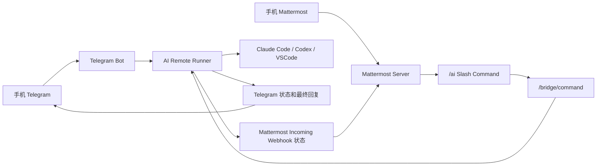

# FFC-AI 新手安装指南

这份 README 根据 `vpn3288/FFC-AI` 当前仓库内容整理，面向第一次部署的人。你可以把它当作仓库根目录 `README.md` 使用，也可以先照着它完成一次测试机部署。

FFC-AI 的核心目标是：让你在手机上通过 Telegram 或 Mattermost 发指令，远程控制一台本地、WSL、小主机或 VPS 上的 AI runner。AI runner 再去调用 Claude Code、Codex 或 VSCode 相关能力完成任务。

它不是新的聊天软件，也不是单纯的 Mattermost 安装器。真正执行 AI 任务的是 runner，Telegram 和 Mattermost 只是手机入口。

## 目录

1. [一键复制安装](#一键复制安装)
2. [第三方大模型配置](#第三方大模型配置)
3. [先看结论](#先看结论)
4. [系统架构](#系统架构)
5. [新手推荐路线](#新手推荐路线)
6. [准备工作](#准备工作)
7. [方式 A：Telegram 快速部署](#方式-a-telegram-快速部署)
8. [方式 B：Mattermost 完整部署](#方式-b-mattermost-完整部署)
9. [方式 C：已有 Mattermost 或 1Panel](#方式-c-已有-mattermost-或-1panel)
10. [安装 AI Runner](#安装-ai-runner)
11. [连接 Runner 和 Mattermost](#连接-runner-和-mattermost)
12. [验证是否成功](#验证是否成功)
13. [手机端常用命令](#手机端常用命令)
14. [常见问题](#常见问题)
15. [升级、回滚和卸载](#升级回滚和卸载)
16. [安全提醒](#安全提醒)
17. [开发和测试](#开发和测试)

## 一键复制安装

新手先看这里。下面的命令都是完整命令块，可以直接复制粘贴到服务器终端里执行。

请注意三件事：

- 先选一种安装方案，不要把 Codex、Claude Code、VSCode 三个安装块都执行一遍。
- 命令会自动进入 `/root/FFC-AI`，不要在 `~` 目录里直接运行 `scripts/install-runner.sh`。
- Telegram 配对需要 BotFather token 和你的 Telegram 数字 ID，这一步脚本会提示你输入 token。

### 方案 1：Codex + Telegram，推荐新手先用

复制整段执行：

```bash
set -e

cd /root
apt-get update
apt-get install -y sudo git curl ca-certificates

if [ -d /root/FFC-AI/.git ]; then
  cd /root/FFC-AI
  git pull --ff-only
else
  git clone https://github.com/vpn3288/FFC-AI.git /root/FFC-AI
  cd /root/FFC-AI
fi

AI_RUNNER_COMPONENTS=codex,telegram sudo -E bash scripts/install-runner.sh
```

安装完成后，继续配对 Telegram。把 `你的Telegram数字ID` 换成你的数字 ID：

```bash
cd /root/FFC-AI
sudo bash scripts/pair-telegram.sh --telegram-id 你的Telegram数字ID
```

脚本会提示输入 BotFather 给你的 bot token。输入时终端不会显示字符，这是正常的。

### 方案 2：Claude Code + Telegram

如果你准备用 Claude Code，复制整段执行：

```bash
set -e

cd /root
apt-get update
apt-get install -y sudo git curl ca-certificates

if [ -d /root/FFC-AI/.git ]; then
  cd /root/FFC-AI
  git pull --ff-only
else
  git clone https://github.com/vpn3288/FFC-AI.git /root/FFC-AI
  cd /root/FFC-AI
fi

AI_RUNNER_COMPONENTS=claude-code,telegram sudo -E bash scripts/install-runner.sh
```

然后配对 Telegram：

```bash
cd /root/FFC-AI
sudo bash scripts/pair-telegram.sh --telegram-id 你的Telegram数字ID
```

### 方案 3：VSCode + Telegram

如果你准备用 VSCode adapter，复制整段执行：

```bash
set -e

cd /root
apt-get update
apt-get install -y sudo git curl ca-certificates

if [ -d /root/FFC-AI/.git ]; then
  cd /root/FFC-AI
  git pull --ff-only
else
  git clone https://github.com/vpn3288/FFC-AI.git /root/FFC-AI
  cd /root/FFC-AI
fi

AI_RUNNER_COMPONENTS=vscode,telegram sudo -E bash scripts/install-runner.sh
```

然后配对 Telegram：

```bash
cd /root/FFC-AI
sudo bash scripts/pair-telegram.sh --telegram-id 你的Telegram数字ID
```

### 不知道 Telegram 数字 ID 怎么办

先创建 Telegram bot，并给你的 bot 发一条消息，例如 `/start`。然后复制执行：

```bash
cd /root/FFC-AI
sudo bash scripts/pair-telegram.sh --discover-chat-id
```

脚本会提示输入 BotFather token，并尝试发现 chat_id。看到数字 ID 后，再执行正式配对：

```bash
cd /root/FFC-AI
sudo bash scripts/pair-telegram.sh --telegram-id 你的Telegram数字ID
```

### 安装完成后怎么测试

在 Telegram 里发送：

```text
/ai 状态
/ai 帮助
/ai 功能
```

服务器上也可以执行：

```bash
cd /root/FFC-AI
sudo bash scripts/validate-core-ready.sh
```

### Mattermost 服务器一键安装

如果你要自建 Mattermost，把 `ai.example.com` 换成你自己的域名，复制整段在 VPS 上执行：

```bash
set -e

cd /root
apt-get update
apt-get install -y sudo git curl ca-certificates

if [ -d /root/FFC-AI/.git ]; then
  cd /root/FFC-AI
  git pull --ff-only
else
  git clone https://github.com/vpn3288/FFC-AI.git /root/FFC-AI
  cd /root/FFC-AI
fi

sudo bash scripts/install-communication-vps.sh --domain ai.example.com
```

安装 Mattermost 前，请先确认域名已经解析到 VPS，并且 80、443 端口开放。

## 第三方大模型配置

如果你使用的是第三方大模型接口，通常需要填三样东西：

- `第三方网址`：服务商给你的 API Base URL，例如 `https://api.example.com/v1`。
- `模型名`：服务商后台写的模型 ID，例如 `gpt-4o`、`gpt-5.5`、`claude-sonnet-4-5`。
- `API Key`：服务商后台生成的密钥，通常以 `sk-` 开头，也可能是其他格式。

最简单的判断方法：

| 你安装的组件 | Telegram 里用的目标名 | 第三方网址变量 | API Key 变量 | 模型变量 |
| --- | --- | --- | --- | --- |
| `codex` | `codex` | `CODEX_BASE_URL` | `OPENAI_API_KEY` | `CODEX_MODEL` |
| `claude-code` | `claude-code` | `ANTHROPIC_BASE_URL` | `ANTHROPIC_AUTH_TOKEN` | `CLAUDE_MODEL` |
| `vscode` | `vscode` | `ANTHROPIC_BASE_URL` | `ANTHROPIC_AUTH_TOKEN` | `VSCODE_CLAUDE_MODEL` |

大多数 OpenAI 兼容第三方接口，建议先用 `codex`。第三方网址一般要带 `/v1`，例如 `https://api.example.com/v1`。如果服务商文档明确说不要 `/v1`，再按服务商文档填写。

### 安装时一次填好，推荐

如果你准备用 `Codex + Telegram`，复制下面整段。它会让你手动输入第三方网址、模型名和 API Key，API Key 输入时不会显示在屏幕上。

```bash
set -e

cd /root
apt-get update
apt-get install -y sudo git curl ca-certificates

read -r -p "请输入第三方 API 地址，例如 https://api.example.com/v1: " CODEX_BASE_URL
read -r -p "请输入模型名，例如 gpt-4o: " CODEX_MODEL
read -r -s -p "请输入 API Key: " OPENAI_API_KEY
echo

export CODEX_BASE_URL
export CODEX_MODEL
export OPENAI_API_KEY

if [ -d /root/FFC-AI/.git ]; then
  cd /root/FFC-AI
  git pull --ff-only
else
  git clone https://github.com/vpn3288/FFC-AI.git /root/FFC-AI
  cd /root/FFC-AI
fi

AI_RUNNER_COMPONENTS=codex,telegram sudo -E bash scripts/install-runner.sh
```

安装完再配对 Telegram：

```bash
cd /root/FFC-AI
sudo bash scripts/pair-telegram.sh --telegram-id 你的Telegram数字ID
```

如果你准备用 `Claude Code + Telegram`，复制下面整段：

```bash
set -e

cd /root
apt-get update
apt-get install -y sudo git curl ca-certificates

read -r -p "请输入 Claude 兼容 API 地址: " ANTHROPIC_BASE_URL
read -r -p "请输入模型名，例如 claude-sonnet-4-5: " CLAUDE_MODEL
read -r -s -p "请输入 API Key: " ANTHROPIC_AUTH_TOKEN
echo

export ANTHROPIC_BASE_URL
export CLAUDE_MODEL
export ANTHROPIC_AUTH_TOKEN

if [ -d /root/FFC-AI/.git ]; then
  cd /root/FFC-AI
  git pull --ff-only
else
  git clone https://github.com/vpn3288/FFC-AI.git /root/FFC-AI
  cd /root/FFC-AI
fi

AI_RUNNER_COMPONENTS=claude-code,telegram sudo -E bash scripts/install-runner.sh
```

如果你准备用 `VSCode + Telegram`，复制下面整段：

```bash
set -e

cd /root
apt-get update
apt-get install -y sudo git curl ca-certificates

read -r -p "请输入 Claude 兼容 API 地址: " ANTHROPIC_BASE_URL
read -r -p "请输入模型名，例如 gpt-4o 或 claude-sonnet-4-5: " VSCODE_CLAUDE_MODEL
read -r -s -p "请输入 API Key: " ANTHROPIC_AUTH_TOKEN
echo

export ANTHROPIC_BASE_URL
export VSCODE_CLAUDE_MODEL
export ANTHROPIC_AUTH_TOKEN

if [ -d /root/FFC-AI/.git ]; then
  cd /root/FFC-AI
  git pull --ff-only
else
  git clone https://github.com/vpn3288/FFC-AI.git /root/FFC-AI
  cd /root/FFC-AI
fi

AI_RUNNER_COMPONENTS=vscode,telegram sudo -E bash scripts/install-runner.sh
```

### 安装后在 Telegram 里设置

已经安装好 runner 后，也可以直接在 Telegram 里发命令补配置。

Codex 示例：

```text
/ai 代理 设置 codex https://你的第三方网址/v1
/ai 密钥 设置 codex 你的APIKEY
/ai GPT模型 设置 codex 你的模型名
/ai 配置 查看 codex
```

Claude Code 示例：

```text
/ai 代理 设置 claude-code https://你的第三方网址
/ai 密钥 设置 claude-code 你的APIKEY
/ai Claude模型 设置 claude-code 你的模型名
/ai 配置 查看 claude-code
```

VSCode 示例：

```text
/ai 代理 设置 vscode https://你的第三方网址
/ai 密钥 设置 vscode 你的APIKEY
/ai Claude模型 设置 vscode 你的模型名
/ai 配置 查看 vscode
```

如果你的 `claude-code` 或 `vscode` 实际连接的是 GPT 兼容网关，也可以用 GPT 模型命令：

```text
/ai GPT模型 设置 claude-code gpt-4o
/ai GPT模型 设置 vscode gpt-4o
```

配置完成后，在 Telegram 里测试：

```text
/ai 模型 列表 codex
/ai 状态
你好，回复一句测试
```

如果你用的是 `claude-code` 或 `vscode`，把第一行里的 `codex` 换成 `claude-code` 或 `vscode`。

安全提醒：API Key 发到 Telegram 后，聊天记录里可能会留下密钥。个人测试可以这样做；正式环境建议优先用“安装时一次填好”的方式，或者只在可信的私聊 bot 中操作。

## 先看结论

如果你只想最快用手机控制 AI：

```bash
cd /root
apt-get update
apt-get install -y sudo git curl ca-certificates
git clone https://github.com/vpn3288/FFC-AI.git
cd /root/FFC-AI

AI_RUNNER_COMPONENTS=codex,telegram sudo -E bash scripts/install-runner.sh
sudo bash scripts/pair-telegram.sh --telegram-id 你的Telegram数字ID
```

如果你想自建团队频道、状态频道、slash command 和 webhook：

```bash
cd /root
apt-get update
apt-get install -y sudo git curl ca-certificates
git clone https://github.com/vpn3288/FFC-AI.git
cd /root/FFC-AI

bash scripts/install-communication-vps.sh --dry-run --domain ai.example.com
sudo bash scripts/install-communication-vps.sh --domain ai.example.com
```

然后再安装 runner、补全 `/ai` slash command、执行配对和验证。

最重要的验收标准只有两个：

```text
Telegram 里发送 /ai 状态，能收到 runner 状态。
Mattermost 里发送 /ai 状态，能收到 runner 状态。
```

只用 Telegram 时，达到第一个即可。只用 Mattermost 时，达到第二个即可。

## 系统架构



几个关键概念：

- `AI remote runner`：真正执行命令和调用 AI provider 的 Python 服务。
- `provider`：实际 AI 工具，目前支持 `claude-code`、`codex`、`vscode`。
- `Telegram`：最快的手机入口，不需要自建聊天服务器。
- `Mattermost`：自建团队通信入口，支持频道、slash command、incoming webhook。
- `/bridge/command`：Mattermost slash command 或验证脚本访问 runner 的 HTTP 接口。
- `AI_BRIDGE_SHARED_SECRET`：bridge 验证用共享密钥，不要发到聊天里。
- `MATTERMOST_SLASH_TOKEN`：Mattermost slash command token，也不要发到聊天里。

## 新手推荐路线

### 路线 1：只用 Telegram

适合：

- 想最快跑通手机控制 AI。
- 不想先折腾域名、TLS、Docker、Mattermost。
- 个人使用为主。

推荐命令：

```bash
AI_RUNNER_COMPONENTS=codex,telegram sudo -E bash scripts/install-runner.sh
sudo bash scripts/pair-telegram.sh --telegram-id 你的Telegram数字ID
```

### 路线 2：Telegram + Codex

适合：

- 你已经有 OpenAI API Key 或已配置 Codex CLI。
- 希望手机发任务，runner 用 Codex 执行。

可提前设置：

```bash
export OPENAI_API_KEY="你的OpenAI API Key"
export CODEX_MODEL="gpt-5.5"
export CODEX_BASE_URL="https://api.openai.com/v1"

AI_RUNNER_COMPONENTS=codex,telegram sudo -E bash scripts/install-runner.sh
```

### 路线 3：Mattermost + Runner

适合：

- 想自建一个 AI 操作频道。
- 想把状态、错误、归档分频道展示。
- 想让团队成员一起在 Mattermost 中使用 `/ai`。

推荐顺序：

1. 在 VPS 上部署 Mattermost。
2. 在 runner 机器上安装 AI runner。
3. 确认 Mattermost 能访问 runner 的 `/bridge/command`。
4. 运行 `bootstrap-mattermost.sh` 创建 `/ai` slash command。
5. 运行 `pair-runner.sh` 把 Mattermost token 和 bridge secret 写入 runner。
6. 运行验证脚本。

### 路线 4：已有 Mattermost 或 1Panel

适合：

- 你已经有 Mattermost。
- 你通过 1Panel、Docker Compose 或其他方式部署 Mattermost。

这时不一定要用 `install-communication-vps.sh`。你只要手动完成同样的集成对象：

- team，例如 `ai-lab`
- channel，例如 `ai-ops`、`ai-status`
- incoming webhook
- slash command，trigger 为 `ai`
- slash command URL 指向 runner 的 `/bridge/command`
- slash command token 写入 runner

## 准备工作

### Runner 机器要求

runner 可以装在：

- Ubuntu 或 Debian 服务器
- WSL
- 本地 Linux 小主机
- 和 Mattermost 同一台 VPS
- 单独一台 VM

建议准备：

```text
Python 3.10+
sudo
git
curl
openssl
gpg
apt-get
systemd，推荐但不是必须
```

如果选择 Codex，建议系统有 Node.js 20+ 和 npm。安装脚本会尝试通过 NodeSource 安装 Node.js 20，并通过 npm 安装仓库锁定的 Codex CLI 包。

如果选择 Claude Code，需要 `claude` 命令可用，并且 `claude auth status --json` 能通过。

如果选择 VSCode，需要 `code` 命令可用。脚本会尝试通过 Microsoft apt repository 安装 VSCode，并创建 root/full-access wrapper：

```text
/usr/local/bin/code-root
```

### Mattermost VPS 要求

如果你要用项目脚本部署 Mattermost，建议准备：

```text
Ubuntu 24.04 LTS 或 Debian 12
2 vCPU+
4 GB RAM+
40 GB 磁盘+
公网 IP
域名，例如 ai.example.com
80 和 443 端口开放
```

域名需要提前解析到 VPS 公网 IP。

脚本会安装或使用：

- Docker Engine
- Docker Compose plugin 或 `docker-compose`
- Mattermost Team Edition
- PostgreSQL
- Caddy

根据 `versions.lock`，数据库和 Caddy 镜像使用带 digest 的锁定版本；Mattermost 默认解析官方 latest release，但脚本要求版本不低于 `10.11.0`。

### 克隆仓库

在要部署的机器上执行：

```bash
sudo apt-get update
sudo apt-get install -y git curl ca-certificates

git clone https://github.com/vpn3288/FFC-AI.git
cd FFC-AI
```

后文所有命令默认都在 `FFC-AI` 仓库目录下执行。

## 方式 A：Telegram 快速部署

Telegram 是最简单的入口。你只需要：

- 一个 Telegram 账号
- BotFather 创建的 bot token
- 你的 Telegram 数字 chat_id 或 user_id
- 一台已经安装 runner 的机器

### 第 1 步：创建 Telegram Bot

在 Telegram 里：

1. 搜索 `@BotFather`。
2. 发送 `/newbot`。
3. 按提示设置机器人名称和用户名。
4. 复制 BotFather 返回的 bot token。
5. 打开你新建的 bot，先发送一条消息，例如 `/start`。

### 第 2 步：安装 Runner，同时启用 Telegram

选择一种 provider。新手通常先选 Codex：

```bash
AI_RUNNER_COMPONENTS=codex,telegram sudo -E bash scripts/install-runner.sh
```

如果你要用 Claude Code：

```bash
AI_RUNNER_COMPONENTS=claude-code,telegram sudo -E bash scripts/install-runner.sh
```

如果你要用 VSCode adapter：

```bash
AI_RUNNER_COMPONENTS=vscode,telegram sudo -E bash scripts/install-runner.sh
```

注意：当前脚本要求一台 VM 只选择一种主 provider。下面这些会被拒绝：

```bash
AI_RUNNER_COMPONENTS=all sudo -E bash scripts/install-runner.sh
AI_RUNNER_COMPONENTS=full sudo -E bash scripts/install-runner.sh
AI_RUNNER_COMPONENTS=claude-code,codex sudo -E bash scripts/install-runner.sh
AI_RUNNER_COMPONENTS=codex,vscode sudo -E bash scripts/install-runner.sh
```

可以加 `telegram`，例如 `codex,telegram`，但不要在同一台机器混装多个主 provider。

### 第 3 步：保存 Bot Token

推荐把 token 写到 root 只读文件，不要直接放命令行里：

```bash
sudo install -m 600 /dev/null /root/ffc-ai-telegram-token
sudo nano /root/ffc-ai-telegram-token
sudo chmod 600 /root/ffc-ai-telegram-token
```

把 BotFather token 粘进去，保存退出。

### 第 4 步：不知道 chat_id 时，先用发现模式

如果你不知道自己的 Telegram 数字 ID：

```bash
sudo bash scripts/pair-telegram.sh \
  --bot-token-file /root/ffc-ai-telegram-token \
  --discover-chat-id
```

然后在 Telegram 里给 bot 发一条消息。脚本会尝试发现 chat_id。

如果脚本已经退出，但你还没记住 chat_id，可以重新执行发现模式。

### 第 5 步：正式配对 Telegram

拿到 chat_id 后执行：

```bash
sudo bash scripts/pair-telegram.sh \
  --bot-token-file /root/ffc-ai-telegram-token \
  --telegram-id 你的Telegram数字ID
```

这个脚本会做这些事：

- 调用 Telegram `getMe` 验证 bot token。
- 默认调用 `deleteWebhook`，让 bot 使用 long polling。
- 同步 Telegram 命令菜单。
- 发送并编辑一条测试消息，验证状态消息可更新。
- 写入 `/var/lib/ai-remote-runner/config.env`。
- 启动或重启 `ai-telegram-bot.service`。
- 默认运行 `validate-core-ready.sh`。

如果机器没有 systemd，脚本会提示你手动运行：

```bash
sudo /opt/ai-remote-runner/run-telegram-local.sh
```

### 第 6 步：在 Telegram 测试

发送：

```text
/ai 状态
/ai 帮助
/ai 功能
```

然后试一个普通任务：

```text
请总结当前项目的目录结构
```

Telegram bot 会显示 queued、calling、running、done 或 error 等状态。长任务中它会发送 typing 状态和心跳，避免你误以为断线。

## 方式 B：Mattermost 完整部署

这个方式会用项目脚本在 VPS 上安装 Mattermost、PostgreSQL、Caddy，并创建 FFC-AI 需要的频道和集成对象。

### 第 1 步：确认域名和端口

假设你的域名是：

```text
ai.example.com
```

需要确认：

- DNS A 记录已经指向 VPS 公网 IP。
- VPS 安全组或防火墙开放 80 和 443。
- VPS 上没有其他服务占用 80 和 443。

### 第 2 步：先 dry-run

在 VPS 上：

```bash
cd /root
git clone https://github.com/vpn3288/FFC-AI.git /root/FFC-AI
cd /root/FFC-AI

bash scripts/install-communication-vps.sh --dry-run --domain ai.example.com
```

`--dry-run` 只打印将要执行的动作，不会真正安装。

### 第 3 步：正式安装 Mattermost

```bash
sudo bash scripts/install-communication-vps.sh --domain ai.example.com
```

脚本默认安装到：

```text
/opt/ffc-ai-mattermost
```

重要文件：

```text
/opt/ffc-ai-mattermost/.env
/opt/ffc-ai-mattermost/docker-compose.yml
/opt/ffc-ai-mattermost/mattermost-objects.json
/opt/ffc-ai-mattermost/install-manifest.json
```

`.env` 里会保存 Mattermost 管理员账号、数据库密码、bridge shared secret、slash token 等敏感信息。不要把它发到聊天里，也不要提交到 GitHub。

安装后 `install-manifest.json` 里的 `platform_ready` 一开始通常是 `false`，这是正常的。它表示还没有完成 runner 配对和集成验证。

### 第 4 步：查看 Mattermost 管理员账号

管理员信息在：

```text
/opt/ffc-ai-mattermost/.env
```

可以查看字段名：

```bash
sudo awk -F= '$1 ~ /^MATTERMOST_ADMIN_/ {print $1"="substr($0,index($0,"=")+1)}' \
  /opt/ffc-ai-mattermost/.env
```

浏览器打开：

```text
https://ai.example.com
```

使用 `.env` 里的管理员账号登录。

### 第 5 步：理解脚本创建的对象

`bootstrap-mattermost.sh` 会创建或复用：

```text
team: ai-lab
channels: ai-ops, ai-status, ai-reviews, ai-errors, ai-archive
bots: ai-bridge, master-writer-ai, claude-code-ai, codex-ai, reviewer-ai-1, reviewer-ai-2, optional-specialist-ai
incoming webhook: 默认绑定 ai-status
slash command: /ai，如果提供了 BRIDGE_COMMAND_URL
```

如果安装 Mattermost 时还不知道 runner 的 bridge 地址，`/ai` slash command 会暂时不创建。后面知道地址后重新运行 bootstrap 即可。

## 方式 C：已有 Mattermost 或 1Panel

如果你已经有 Mattermost，或者用 1Panel 部署了 Mattermost，不一定要运行 `install-communication-vps.sh`。

你需要手动准备：

- 一个 team，例如 `ai-lab`。
- 一个频道接收命令，例如 `ai-ops`。
- 一个频道接收状态，例如 `ai-status`。
- 一个 incoming webhook，建议绑定到 `ai-status`。
- 一个 slash command：
  - trigger：`ai`
  - request URL：`http://runner可访问地址/bridge/command`
  - method：POST

然后把以下信息保存到 runner：

- Mattermost URL
- incoming webhook URL
- slash command token
- bridge shared secret

如果想复用本仓库的 `bootstrap-mattermost.sh` 自动创建对象，需要注意：脚本依赖 `mmctl --local`，并默认认为 Mattermost 位于：

```text
/opt/ffc-ai-mattermost
```

1Panel 的目录、容器名、网络名可能不同，所以你可能需要手动创建 webhook 和 slash command，或者改脚本适配自己的 1Panel 部署。

## 安装 AI Runner

Runner 是 Python 包加 systemd 服务。项目的 `pyproject.toml` 声明包名为：

```text
ai-remote-runner
```

命令入口为：

```text
ai-remote-runner = ai_remote_runner.cli:main
```

### 选择 Provider

必须通过 `AI_RUNNER_COMPONENTS` 显式声明这台机器要装什么。

Codex 专机：

```bash
AI_RUNNER_COMPONENTS=codex sudo -E bash scripts/install-runner.sh
```

Codex 专机，同时启用 Telegram：

```bash
AI_RUNNER_COMPONENTS=codex,telegram sudo -E bash scripts/install-runner.sh
```

Claude Code 专机：

```bash
AI_RUNNER_COMPONENTS=claude-code sudo -E bash scripts/install-runner.sh
```

VSCode 专机：

```bash
AI_RUNNER_COMPONENTS=vscode sudo -E bash scripts/install-runner.sh
```

如果你想指定默认 provider：

```bash
AI_RUNNER_COMPONENTS=codex,telegram \
AI_DEFAULT_PROVIDER=codex \
sudo -E bash scripts/install-runner.sh
```

### Codex 配置

如果启用 `codex`，脚本会：

- 检查 `codex --version`
- 尝试安装 Node.js 20+
- 尝试通过 npm 安装 `@openai/codex@0.137.0`
- 检查 `codex exec` 是否支持 runner 需要的参数

可提前设置：

```bash
export OPENAI_API_KEY="你的OpenAI API Key"
export CODEX_MODEL="gpt-5.5"
export CODEX_BASE_URL="https://api.openai.com/v1"

AI_RUNNER_COMPONENTS=codex,telegram sudo -E bash scripts/install-runner.sh
```

安装脚本会为 root/global 运行写入 Codex 配置。默认是 full-access VM 模式：

```toml
approval_policy = "never"
sandbox_mode = "danger-full-access"

[shell_environment_policy]
inherit = "all"

[sandbox_workspace_write]
network_access = true
```

这意味着 Codex 在这台 VM 里有很高权限。请只在你专门为 AI 准备的机器或 VM 中运行。

### Claude Code 配置

如果启用 `claude-code`，脚本会：

- 检查 `claude --version`
- 尝试安装 Claude Code
- 检查 `claude auth status --json`
- 检查 Claude Code 是否支持 full-access 所需参数

你需要提前完成 Claude Code 登录或 API 配置，否则验证不会通过。

常见环境变量：

```bash
export ANTHROPIC_API_KEY="你的Anthropic API Key"
export ANTHROPIC_BASE_URL="https://你的兼容网关"
export CLAUDE_MODEL="claude-opus-4-8"
```

然后：

```bash
AI_RUNNER_COMPONENTS=claude-code,telegram sudo -E bash scripts/install-runner.sh
```

### VSCode 配置

如果启用 `vscode`，脚本会：

- 检查 `code --version`
- 如果缺失，尝试通过 Microsoft apt repository 安装 VSCode
- 创建 `/usr/local/bin/code-root`
- 写 root VSCode settings，默认关闭 workspace trust 和 telemetry
- 使用 Claude 后端相关配置

常见变量：

```bash
export VSCODE_CLAUDE_MODEL="gpt-5.5"

AI_RUNNER_COMPONENTS=vscode,telegram sudo -E bash scripts/install-runner.sh
```

### Runner 目录

默认路径：

```text
/opt/ai-remote-runner             # 安装代码和虚拟环境
/var/lib/ai-remote-runner         # 状态、配置、凭据、上下文
/srv/ai-workspaces                # AI 工作区
/var/lib/ai-remote-runner/config.env
/var/lib/ai-remote-runner/install-manifest.json
```

systemd 服务：

```text
/etc/systemd/system/ai-remote-runner.service
/etc/systemd/system/ai-telegram-bot.service
```

查看状态：

```bash
sudo systemctl status ai-remote-runner
sudo systemctl status ai-telegram-bot
```

查看日志：

```bash
sudo journalctl -u ai-remote-runner -n 100 --no-pager
sudo journalctl -u ai-telegram-bot -n 100 --no-pager
```

如果没有 systemd，比如部分 WSL 环境，脚本会生成：

```text
/opt/ai-remote-runner/run-local.sh
/opt/ai-remote-runner/run-telegram-local.sh
```

手动运行：

```bash
sudo /opt/ai-remote-runner/run-local.sh
sudo /opt/ai-remote-runner/run-telegram-local.sh
```

## 连接 Runner 和 Mattermost

Mattermost 的 `/ai` slash command 必须能访问 runner：

```text
http://runner可访问地址/bridge/command
```

runner 默认监听：

```text
127.0.0.1:8765
```

### 同一台机器部署

如果 Mattermost 和 runner 在同一台机器上，并且 Mattermost 不是从容器里访问宿主机，可能可以用：

```text
http://127.0.0.1:8765/bridge/command
```

### Mattermost 在 Docker 里

如果 Mattermost 在 Docker 容器里，`127.0.0.1` 通常指 Mattermost 容器自己，不是 VPS 宿主机，也不是 runner。

这时你需要使用容器能访问到的地址，例如：

```text
http://宿主机内网IP:8765/bridge/command
http://host.docker.internal:8765/bridge/command
http://VPN地址:8765/bridge/command
```

如果 slash command URL 使用 `127.0.0.1`、内网 IP 或 `host.docker.internal`，`bootstrap-mattermost.sh` 会尝试把该 host 写入 Mattermost 的 `AllowedUntrustedInternalConnections`，并在可判断时重启 Mattermost 让配置生效。

### Runner 在家里或 WSL，Mattermost 在 VPS

可以用反向 SSH 隧道：

```bash
sudo bash scripts/setup-runner-tunnel.sh --vps-host YOUR_VPS_IP
```

默认会创建：

```text
/etc/systemd/system/ai-remote-runner-tunnel.service
```

默认把 VPS 上的：

```text
127.0.0.1:18765
```

转发到 runner 本机：

```text
127.0.0.1:8765
```

脚本最后会提示：

```text
bridge command URL from the VPS is http://127.0.0.1:18765/bridge/command
```

注意：这是 VPS 主机视角。Mattermost 容器里不一定能直接访问 VPS 主机的 `127.0.0.1:18765`。如果 Mattermost 在容器里，还需要处理 Docker 网络视角。

### 创建或更新 `/ai` slash command

知道 bridge URL 后，在 Mattermost VPS 上执行：

```bash
sudo env MATTERMOST_INSTALL_DIR=/opt/ffc-ai-mattermost \
  BRIDGE_COMMAND_URL="http://你的bridge地址/bridge/command" \
  bash scripts/bootstrap-mattermost.sh
```

成功后，`/opt/ffc-ai-mattermost/.env` 会包含：

```text
MATTERMOST_SLASH_TOKEN=...
```

`/opt/ffc-ai-mattermost/mattermost-objects.json` 会包含 incoming webhook ID。假设 ID 是 `abc123`，webhook URL 通常是：

```text
https://ai.example.com/hooks/abc123
```

### 把 Mattermost 配置写入 Runner

`pair-runner.sh` 会把 Mattermost URL、webhook URL、slash token、bridge secret 写入 runner 的：

```text
/var/lib/ai-remote-runner/config.env
```

先准备两个 root 只读文件：

```bash
sudo install -m 600 /dev/null /root/ffc-ai-bridge-secret
sudo install -m 600 /dev/null /root/ffc-ai-slash-token
```

如果 Mattermost 是项目脚本部署的，可以从 VPS `.env` 里读取：

```bash
sudo awk -F= '$1=="AI_BRIDGE_SHARED_SECRET"{print $2}' \
  /opt/ffc-ai-mattermost/.env | sudo tee /root/ffc-ai-bridge-secret >/dev/null

sudo awk -F= '$1=="MATTERMOST_SLASH_TOKEN"{print $2}' \
  /opt/ffc-ai-mattermost/.env | sudo tee /root/ffc-ai-slash-token >/dev/null

sudo chmod 600 /root/ffc-ai-bridge-secret /root/ffc-ai-slash-token
```

如果 runner 和 Mattermost 不在同一台机器，请通过 SSH、密钥管理器或其他安全方式传输这些文件，不要通过聊天发送。

然后在 runner 机器上执行：

```bash
sudo bash scripts/pair-runner.sh \
  --platform-url "https://ai.example.com" \
  --webhook-url "https://ai.example.com/hooks/你的WebhookID" \
  --transfer-method manual-secure \
  --bridge-secret-file /root/ffc-ai-bridge-secret \
  --slash-token-file /root/ffc-ai-slash-token
```

`--transfer-method` 可选值：

```text
ssh
broker
manual-secure
```

当前脚本要求 bridge secret 和 slash token 从文件或 stdin 读取，不支持把 bridge secret 直接写到命令参数里。这是为了避免 shell history 或进程列表泄露密钥。

## 验证是否成功

### 验证 Runner 核心能力

在 runner 机器上：

```bash
sudo bash scripts/validate-core-ready.sh
```

成功时会看到：

```text
[validate-core-ready] core_ready=true
```

这个脚本会根据本机 `AI_RUNNER_PROVIDERS` 只测试启用的 provider：

- Codex 专机只测 Codex。
- Claude Code 专机只测 Claude Code。
- VSCode 专机只测 VSCode adapter。
- management-only 机器只测 runner 命令和 bridge loopback。

它会做真实 full-access smoke test，包括：

- 文件读写
- `/tmp` 访问
- 网络访问
- Python venv 和本地包安装
- bridge loopback

只安装成功不等于 `core_ready=true`。通过验证才算真的能用。

### 验证 Mattermost 集成

在能访问 Mattermost 配置和 runner 的机器上：

```bash
sudo bash scripts/validate-integration.sh
```

成功时会看到：

```text
[validate-integration] bridge loopback passed
[validate-integration] Mattermost /ai commands and credential confirmation passed
```

如果这台机器只能访问 runner bridge，不能访问 Mattermost REST API，可以临时跳过 Mattermost slash command 层验证：

```bash
sudo env VALIDATE_MATTERMOST_COMMAND=false scripts/validate-integration.sh
```

注意：跳过 slash command 时，只能证明 bridge 可访问，不能把 Mattermost 的 `platform_ready` 标记为完整 validated。

如果你想连真实后台 AI 任务派发一起测：

```bash
sudo env VALIDATE_MATTERMOST_BACKGROUND_TASK=true scripts/validate-integration.sh
```

默认不打开这个选项，是为了避免普通验证消耗 provider 预算。

### 手机端验证

Telegram：

```text
/ai 状态
/ai 帮助
/ai 提供商 列表
```

Mattermost：

```text
/ai 状态
/ai 帮助
/ai 功能
```

如果这些命令能返回，说明手机入口已经能到达 runner。

## 手机端常用命令

下面命令来自当前 `src/ai_remote_runner/commands.py` 的实际命令表。

### 基础命令

```text
/ai 状态
/ai 帮助
/ai 命令
/ai 索引
/ai 功能
/ai 确认 <token>
```

### 直接执行任务

在 Telegram 里，配对后可以直接发普通消息让默认 provider 执行任务。

在 Mattermost 里，通常使用：

```text
/ai 请总结这个项目
/ai 帮我检查 scripts 目录里的安装脚本
```

Mattermost 中 AI 长任务会先返回“已收到任务，正在后台运行”，然后通过 incoming webhook 发送状态和最终结果。

### Provider

```text
/ai 提供商 列表
/ai 提供商 使用 codex
/ai 提供商 使用 claude-code
/ai 提供商 使用 vscode
```

### 模型和 API 配置

详细的新手说明请看前面的 [第三方大模型配置](#第三方大模型配置)。这里放手机端常用命令速查。

Codex 常用：

```text
/ai 代理 设置 codex https://你的第三方网址/v1
/ai 密钥 设置 codex 你的APIKEY
/ai GPT模型 设置 codex 你的模型名
/ai 配置 查看 codex
```

Claude Code 常用：

```text
/ai 代理 设置 claude-code https://你的第三方网址
/ai 密钥 设置 claude-code 你的APIKEY
/ai Claude模型 设置 claude-code 你的模型名
/ai 配置 查看 claude-code
```

VSCode 常用：

```text
/ai 代理 设置 vscode https://你的第三方网址
/ai 密钥 设置 vscode 你的APIKEY
/ai Claude模型 设置 vscode 你的模型名
/ai 配置 查看 vscode
```

查看模型列表：

```text
/ai 模型 列表 codex
/ai 模型 列表 claude-code
/ai 模型 列表 vscode
```

兼容旧命令仍存在：

```text
/ai 模型 设置 ...
/ai 模型 使用 ...
```

提醒：不建议把 API key 直接发到普通聊天里。更安全的方式是在安装时通过服务器终端输入，或者只在可信的私聊 bot 中操作。

### 上下文和对话

```text
/ai 上下文
/ai 压缩
/ai 新对话
/ai 继续
/ai 对话
/ai 每次新对话
/ai 持续对话
/ai 自动压缩 开启
/ai 自动压缩 关闭
```

### 权限模式

```text
/ai 聊天模式 开启
/ai 编辑模式 开启
/ai shell模式 开启
/ai 完全访问 开启
/ai 最高权限 开启
/ai root权限 开启
```

默认是 full-access 思路。请只在专用 VM 或测试机里运行。

Codex 当前按 full-access 执行。如果你切到非 full 权限又选择 Codex，runner 会返回不支持该 scope，而不是偷偷继续 full-access。

### 预算和轮数

```text
/ai 预算
/ai 预算 设置 0
/ai 预算 设置 无限
/ai 预算 单次 0.5

/ai 轮数 设置 claude-code 20
/ai 轮数 设置 vscode 无限
/ai 重试 设置 claude-code 3
```

`0`、`unlimited`、`无限` 表示不由 runner 传原生预算或轮数限制。

### 工作区

```text
/ai 工作区 列表
/ai 工作区 创建 demo
/ai 工作区 使用 demo
```

工作区名建议只用英文字母、数字、短横线和下划线。

### 指令文件

全局指令：

```text
/ai 全局 查看
/ai 全局 设置 <文本>
/ai 全局 追加 <文本>
/ai 全局 替换 <文本>
/ai 全局 回滚 <snapshot>
/ai 全局 应用
```

项目指令：

```text
/ai 项目 查看
/ai 项目 设置 <文本>
/ai 项目 追加 <文本>
/ai 项目 替换 <文本>
/ai 项目 回滚 <snapshot>
/ai 项目 应用
```

`设置`、`替换`、`回滚` 这类高风险操作会要求确认：

```text
/ai 确认 <token>
```

### 凭据

```text
/ai 凭据 添加 <handle>
/ai 凭据 列表
/ai 凭据 测试 <handle>
/ai 凭据 删除 <handle>
/ai 凭据 授权 <handle> <agent> <action> <duration>
```

凭据设计目标是：聊天里只出现 handle，不出现明文密码、API key、SSH 私钥。

### 本机命令

```text
/ai shell pwd
/ai 执行 bash scripts/smoke-test.sh
/ai 脚本 运行 scripts/smoke-test.sh
```

这是高权限能力，请只在你信任的专用 runner 机器中使用。

### 取消

```text
/ai 停止
/ai 取消
```

当前版本会记录取消标记，并提示不会强制终止已经启动的 provider 进程。

### 扩展索引

```text
/ai 扩展 列表
/ai 工具 列表
/ai mcp 列表
/ai 说明
/ai 说明 生成 <id>
```

当前扩展、工具、MCP 主要是索引和说明能力，还不是完整的一键安装系统。

## 常见问题

### `AI_RUNNER_COMPONENTS is required`

安装 runner 时必须显式声明组件。

正确示例：

```bash
AI_RUNNER_COMPONENTS=codex,telegram sudo -E bash scripts/install-runner.sh
```

错误示例：

```bash
sudo bash scripts/install-runner.sh
AI_RUNNER_COMPONENTS=all sudo -E bash scripts/install-runner.sh
```

### `/ai` 在 Mattermost 里没反应

按顺序检查：

```bash
sudo systemctl status ai-remote-runner
sudo journalctl -u ai-remote-runner -n 100 --no-pager
```

再确认：

- Mattermost slash command trigger 是否是 `ai`。
- slash command URL 是否以 `/bridge/command` 结尾。
- Mattermost 容器是否能访问这个 URL。
- runner 是否监听 `127.0.0.1:8765`。
- `/var/lib/ai-remote-runner/config.env` 里是否有 `MATTERMOST_SLASH_TOKEN`。
- 修改 token 后是否重启过 `ai-remote-runner.service`。

### 出现 `bad_mattermost_slash_token`

说明 Mattermost 发来的 slash token 和 runner 配置里的 `MATTERMOST_SLASH_TOKEN` 不一致。

从 Mattermost VPS 复制 token：

```bash
sudo awk -F= '$1=="MATTERMOST_SLASH_TOKEN"{print $2}' \
  /opt/ffc-ai-mattermost/.env
```

重新写入 runner：

```bash
sudo bash scripts/pair-runner.sh \
  --platform-url "https://ai.example.com" \
  --webhook-url "https://ai.example.com/hooks/你的WebhookID" \
  --transfer-method manual-secure \
  --bridge-secret-file /root/ffc-ai-bridge-secret \
  --slash-token-file /root/ffc-ai-slash-token
```

### Mattermost 容器访问不到 `127.0.0.1:8765`

这是 Docker 网络视角问题。容器里的 `127.0.0.1` 是容器自己。

可选解决：

- 用宿主机内网 IP。
- 配置 `host.docker.internal`。
- 配置 Docker `host-gateway`。
- 用 VPN 地址。
- 用反向 SSH 隧道，并确认 Mattermost 容器能访问隧道地址。

### `core_ready` 一直是 false

执行：

```bash
sudo bash scripts/validate-core-ready.sh
```

常见失败原因：

- `AI_BRIDGE_SHARED_SECRET` 没配置。
- runner 服务没启动。
- Codex 命令不存在或版本不支持需要的 `exec` 参数。
- Claude Code 没登录，`claude auth status --json` 不通过。
- VSCode provider 缺少 `code` 或 Claude 后端。
- provider 无法完成 full-access smoke test。

### Telegram bot 没回应

检查：

```bash
sudo systemctl status ai-telegram-bot
sudo journalctl -u ai-telegram-bot -n 100 --no-pager
```

再确认：

- `TELEGRAM_BOT_TOKEN` 是否写入 `/var/lib/ai-remote-runner/config.env`。
- `TELEGRAM_ALLOWED_CHAT_IDS` 是否包含你的 chat_id。
- 是否运行过 `pair-telegram.sh`。
- 是否被旧 webhook 占用。默认 `pair-telegram.sh` 会调用 `deleteWebhook`。

### 某台机器连不上 Telegram API

如果执行下面命令超时或提示网络不可达：

```bash
curl -I https://api.telegram.org
```

但同一个内网里另一台机器可以正常访问 Telegram，可以在“能访问 Telegram 的机器”上安装一个只给指定内网 IP 使用的转发：

```bash
cd ~/FFC-AI
sudo bash scripts/install-telegram-api-proxy.sh \
  --listen-host 0.0.0.0 \
  --listen-port 18081 \
  --allow-client 需要使用转发的机器IP
```

然后在“连不上 Telegram 的机器”上重新配对 Telegram，把 `能访问Telegram的机器IP` 换成刚才安装转发的机器：

```bash
cd ~/FFC-AI
sudo bash scripts/pair-telegram.sh \
  --telegram-id 你的Telegram数字ID \
  --api-base http://能访问Telegram的机器IP:18081
```

安全提醒：只建议在可信内网里这样做，并且务必用 `--allow-client` 限制来源 IP。

### 反向 SSH 隧道提示 key 没授权

`setup-runner-tunnel.sh` 会生成 SSH key，并打印 public key。把它加入 VPS 对应用户的：

```text
~/.ssh/authorized_keys
```

然后重新运行：

```bash
sudo bash scripts/setup-runner-tunnel.sh --vps-host YOUR_VPS_IP
```

### Mattermost 手机版提示服务端太旧

项目脚本默认 Mattermost 版本来自官方 latest release，并且要求不低于 `10.11.0`。如果你手动固定版本，确保不要低于这个版本：

```bash
sudo env MATTERMOST_VERSION=11.7.2 \
  scripts/install-communication-vps.sh --domain ai.example.com
```

### 安装在 WSL 里没有 systemd

无 systemd 时，脚本不会安装 systemd service，而是生成本地启动脚本：

```bash
sudo /opt/ai-remote-runner/run-local.sh
sudo /opt/ai-remote-runner/run-telegram-local.sh
```

你需要自己保持这些进程运行。

## 升级、回滚和卸载

### 升级仓库代码

```bash
cd FFC-AI
git pull
```

然后根据你安装的组件重新运行对应脚本。脚本按当前实现尽量保持幂等。

Runner：

```bash
AI_RUNNER_COMPONENTS=codex,telegram sudo -E bash scripts/install-runner.sh
```

Mattermost：

```bash
sudo bash scripts/install-communication-vps.sh --domain ai.example.com
```

### 回滚 Runner

```bash
sudo bash scripts/rollback-install.sh
```

它会停止并删除 runner systemd 服务，默认保留工作区和凭据。

### 停止 Mattermost 通信平台

```bash
sudo bash scripts/rollback-communication.sh
```

默认会停止容器并保留数据。

如果你确认要删除 Mattermost 数据：

```bash
sudo bash scripts/rollback-communication.sh --delete-volumes
```

这会删除：

```text
/opt/ffc-ai-mattermost
```

请先备份再执行。

### 建议备份

至少备份这些目录和文件：

```text
/var/lib/ai-remote-runner
/srv/ai-workspaces
/opt/ffc-ai-mattermost/.env
/opt/ffc-ai-mattermost/mattermost-objects.json
/opt/ffc-ai-mattermost/docker-compose.yml
/opt/ffc-ai-mattermost/db
/opt/ffc-ai-mattermost/data
```

## 安全提醒

这个项目默认把 runner 当作你专门创建的 VM 或测试机来使用。它会让 Claude Code、Codex 或 VSCode 在该机器中获得很高权限。

请认真遵守：

- 不要在你的日常主力电脑或重要生产服务器上随便开启 full-access。
- 不要把 API key、SSH 私钥、密码发到 Telegram 或 Mattermost 普通聊天里。
- 不要把 `/var/lib/ai-remote-runner/config.env` 提交到 GitHub。
- 不要把 `/opt/ffc-ai-mattermost/.env` 提交到 GitHub。
- bridge secret、slash token、bot token 都按密钥处理。
- `pair-runner.sh` 要求 secret 从文件或 stdin 读取，这是有意设计。
- Telegram 必须通过明确 chat_id 配对，避免任何人都能给 bot 下命令。
- 群聊默认 `TELEGRAM_GROUP_MODE=mention`，只处理 `/ai`、`/codex`、@bot 或回复 bot 的消息。

## 开发和测试

本地开发或改脚本后，可以运行：

```bash
bash scripts/smoke-test.sh
```

它会检查：

- shell 脚本语法
- Python 单元测试
- `/ai 状态` 解析
- 命令索引
- provider 探测
- 指令追加
- 预算记录

也可以直接运行 pytest：

```bash
python -m pytest
```

项目关键目录：

```text
scripts/                         # 安装、配对、验证、回滚脚本
src/ai_remote_runner/            # runner Python 实现
tests/                           # 单元测试
outputs/                         # 项目规格和说明文档
versions.lock                    # 版本和镜像锁定信息
```

核心 Python CLI：

```bash
python -m ai_remote_runner.cli status
python -m ai_remote_runner.cli index
python -m ai_remote_runner.cli providers
python -m ai_remote_runner.cli bridge --host 127.0.0.1 --port 8765
python -m ai_remote_runner.cli telegram
```

## 当前能力总结

当前仓库已经实现或提供脚本支持：

- Telegram bot 手机入口
- Mattermost VPS 安装脚本
- Mattermost team、channel、bot、webhook、slash command bootstrap
- AI runner 安装脚本
- systemd 服务和无 systemd 本地启动脚本
- Claude Code、Codex、VSCode provider 探测和调用
- Codex JSONL 状态事件转手机状态
- Mattermost `/ai` slash command bridge
- Telegram 和 Mattermost 命令表对齐
- 工作区、指令文件、上下文、预算、凭据基础能力
- full-access provider smoke 验证
- 集成验证
- 回滚脚本

仍需注意：

- 它不是完全无脑的一键安装器。
- 1Panel 和自定义 Mattermost 需要你手动适配集成对象。
- Docker 网络地址需要你根据实际部署确认。
- `/ai 停止` 和 `/ai 取消` 当前不会强杀已经启动的 provider 进程。
- 扩展、工具、MCP 当前主要是索引和说明，还不是完整安装系统。

## 资料来源

本文根据以下仓库文件整理：

- 仓库主页：https://github.com/vpn3288/FFC-AI
- `README.md`
- `pyproject.toml`
- `versions.lock`
- `scripts/install-runner.sh`
- `scripts/pair-telegram.sh`
- `scripts/install-communication-vps.sh`
- `scripts/bootstrap-mattermost.sh`
- `scripts/pair-runner.sh`
- `scripts/setup-runner-tunnel.sh`
- `scripts/validate-core-ready.sh`
- `scripts/validate-integration.sh`
- `src/ai_remote_runner/commands.py`
- `src/ai_remote_runner/providers.py`
- `src/ai_remote_runner/bridge.py`

整理时参考的仓库提交：

```text
1dbae0d132c752f8b841f3f52cb9777c0c2bf122
```
